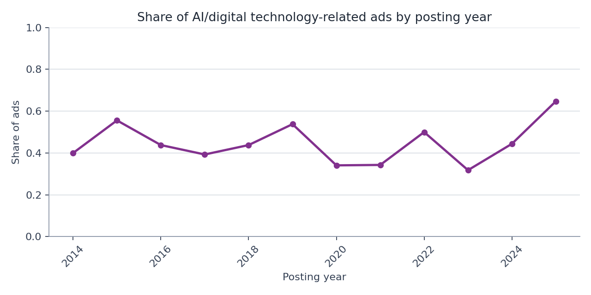
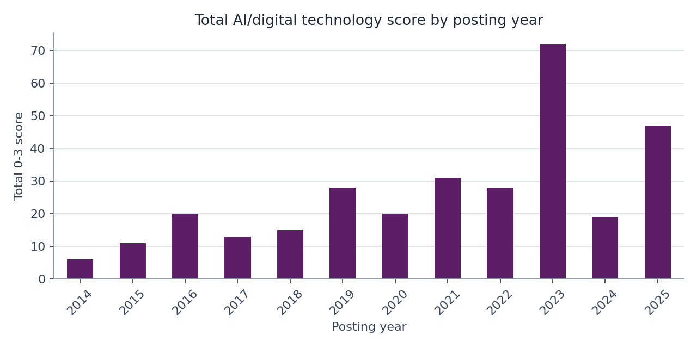
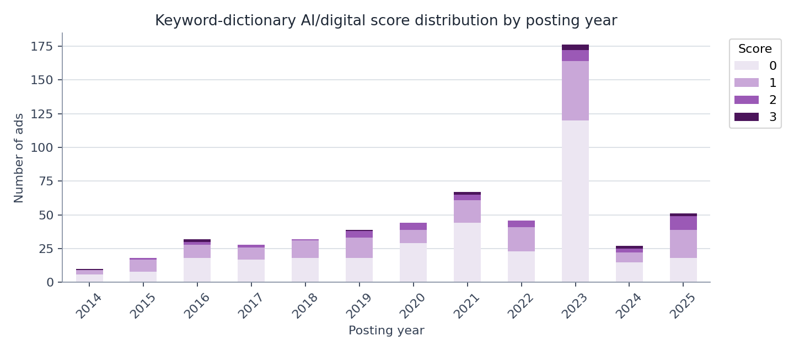
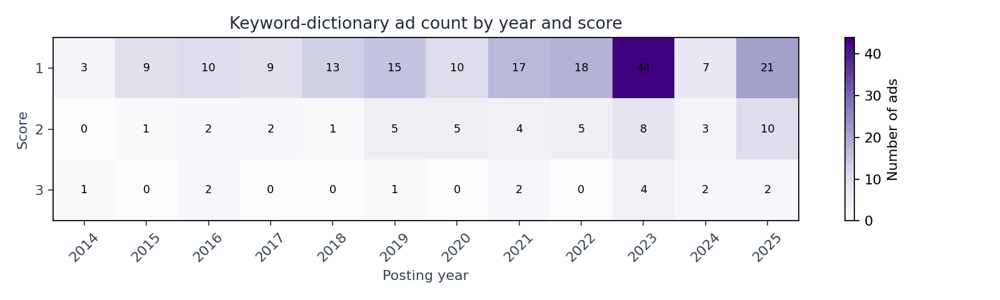
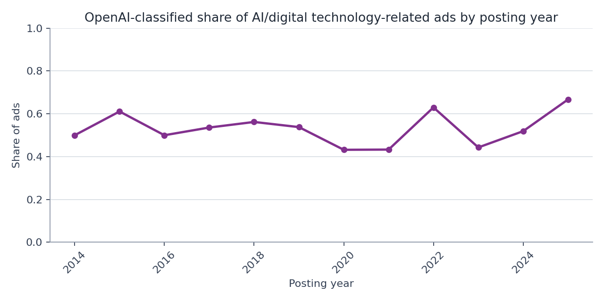
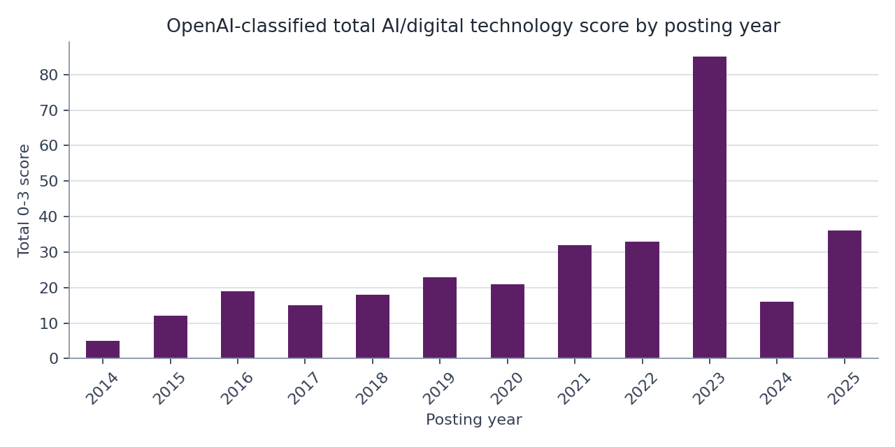
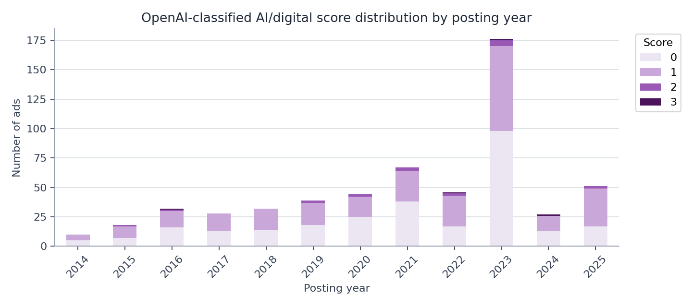
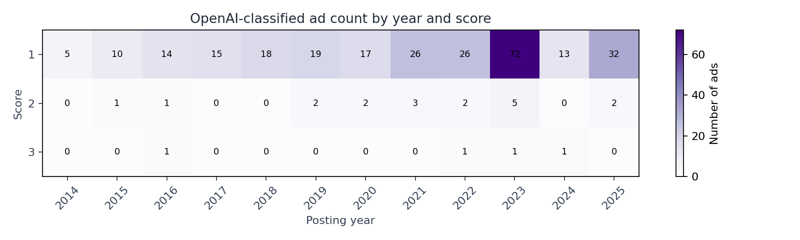

# RA Task: Recruitment Ads Analysis

This repository contains a notebook-based analysis of 51job recruitment ads and listed-company names for the RA screening task.

## Files

`code/`
- `data_analysis.ipynb`: main analysis notebook

`task_description/`
- `RA Task_README.md`: original task instructions

`data/`
- `raw/ra_task_ads.csv`: original recruitment ads CSV
- `raw/ra_task_firms.csv`: original listed-company reference CSV
- `for_viewing/ra_task_ads.xlsx`: Excel-friendly copy generated from the ads CSV for quick viewing
- `for_viewing/ra_task_firms.xlsx`: Excel-friendly copy generated from the listed-company CSV for quick viewing

`output/csv/`
- `openai_ai_scores.csv`: cached OpenAI AI/digital scores for processed ad ids
- `matching_summary.csv`: key company-matching counts
- `dictionary_ai_share_by_year.csv`: yearly AI/digital ad share from the keyword dictionary method
- `dictionary_score_distribution_by_year.csv`: yearly 0-3 score distribution from the keyword dictionary method
- `openai_ai_share_by_year.csv`: yearly AI/digital ad share from the OpenAI method
- `openai_score_distribution_by_year.csv`: yearly 0-3 score distribution from the OpenAI method

`output/figures/`
- `figure_01_dictionary_ai_share_by_year.png`: yearly percentage graph from the keyword dictionary method
- `figure_02_dictionary_ai_total_score_by_year.png`: yearly total 0-3 score graph from the keyword dictionary method
- `figure_03_dictionary_score_distribution_by_year.png`: yearly 0-3 score distribution graph from the keyword dictionary method
- `figure_04_dictionary_score_heatmap_by_year.png`: heatmap of nonzero dictionary scores by year
- `figure_05_openai_ai_share_by_year.png`: yearly percentage graph from the OpenAI method
- `figure_06_openai_ai_total_score_by_year.png`: yearly total 0-3 score graph from the OpenAI method
- `figure_07_openai_score_distribution_by_year.png`: yearly 0-3 score distribution graph from the OpenAI method
- `figure_08_openai_score_heatmap_by_year.png`: heatmap of nonzero OpenAI scores by year

## How to Run

1. Put the original CSV files in `data/raw/`.
2. Optional: create a `.env` file with `OPENAI_API_KEY=your_key_here` if rerunning the OpenAI scoring cells.
3. Open `code/data_analysis.ipynb` and run the cells from top to bottom.
4. Generated tables are saved to `output/csv/`, and generated figures are saved to `output/figures/`.

## Methods

1. Data cleaning
   - Loaded 612 raw ads.
   - Removed malformed text markers such as `<$&0006&$>` from text columns.
   - Treated ads as exact duplicates when all columns except `id` matched after cleaning.
   - Also removed likely short-window reposts: ads with the same `公司名称`, `关联公司名称`, `岗位`, and `所在城市` posted within one month of the previous posting.
   - Removed 39 exact duplicate rows and 3 short-window reposts, leaving 570 deduplicated ads.

2. Company matching
   - First matched ad `公司名称` exactly to listed-company `公司全称`.
   - Then added conservative parent/subsidiary rules for branches and related entities, including recurring patterns such as Ping An insurance branches and Vanke property-service subsidiaries.
   - Exact matching found 355 ads and 341 listed companies.
   - Parent-company matching found 519 ads and 363 listed companies, adding 164 ads beyond exact matching.

3. AI / digital technology scoring
   - Implemented a keyword-dictionary score from 0-3.
   - Also implemented an OpenAI API-based score from 0-3, with one ad per request for easier auditing.
   - Scores include keywords/signals and a short reason.
   - Cached API outputs are saved after each ad to avoid losing progress if interrupted.

## Key Outputs

The output files below are generated by running `code/data_analysis.ipynb`.

Company matching:

| Metric | Count |
|---|---:|
| Raw ads | 612 |
| Deduplicated ads | 570 |
| Duplicate rows removed | 42 |
| Ads matched by exact company name | 355 |
| Unique listed companies matched exactly | 341 |
| Ads matched after parent-company matching | 519 |
| Unique listed companies matched after parent-company matching | 363 |

Keyword-dictionary AI/digital ad share by year:

Keyword-dictionary total AI/digital score by year:

Keyword-dictionary score distribution by year:

Keyword-dictionary score heatmap by year:

OpenAI-classified AI/digital ad share by year:

OpenAI-classified total AI/digital score by year:

OpenAI-classified score distribution by year:

OpenAI-classified score heatmap by year:

## Reference

The OpenAI-based annotation workflow was informed by:

Carlson, N. A., & Burbano, V. (2026). The use of LLMs to annotate data in management research: Foundational guidelines and warnings. *Strategic Management Journal*, 47(3), 699-725. https://doi.org/10.1002/smj.70023

## Tools Used

- Python (pandas, matplotlib, openai, python-dotenv optional)
- OpenAI API
- Codex

## Time Spent

Approximate time spent: 3 hours, including cleaning, matching, scoring, validation, and documentation.
